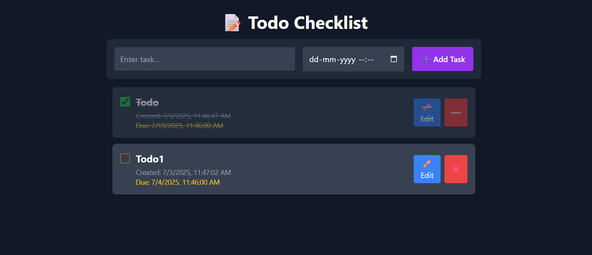

# 📝 Todo Checklist App (React + Node.js + File Storage)

This is a full-stack **Todo Checklist** app built with:

- 🌐 **React (Vite)** — Frontend UI
- 🔧 **Node.js + Express** — Backend API
- 💾 **File-based storage (`tasks.txt`)** — for persistent tasks

## 📦 Features

- ✅ Add, remove, complete tasks
- ⏰ Set due date & time for each task
- 🔔 Desktop notification when task is due
- 🌑 Fully responsive **dark theme** UI
- ✏️ **Edit** task text in place
- 💾 Persistent tasks saved in `tasks.txt` file
- 🚀 One-command start for fullstack app (`npm run dev`)

---

## 📁 Project Structure
```
root/
├── public/
├── src/
│ ├── components/
│ │ ├── TodoList.jsx
│ │ ├── TodoItem.jsx
│ │ └── TodoForm.jsx
│ └── main.jsx
├── server.cjs
├── tasks.txt (auto-created)
├── package.json
└── README.md
```
---
## 🖼️ Demo




## 🚀 Setup Instructions

### 1. Clone the project

```bash
git clone <your-repo-url>
cd todochecklist
```

### 2. Install dependencies
```bash
npm install
```
### 3. Run the full app (frontend + backend)
```bash
npm run dev
```
This will:
    ⚛️ Start React on http://localhost:5173
    🛠 Start Node backend on http://localhost:4000

### 🧠 How It Works
    On app load, React requests tasks from http://localhost:4000/tasks
    Backend reads from tasks.txt file and returns tasks
    When tasks change, React POSTs updated list to backend
    Backend saves tasks to tasks.txt

### Built with ❤️ using React, Tailwind CSS, and Express